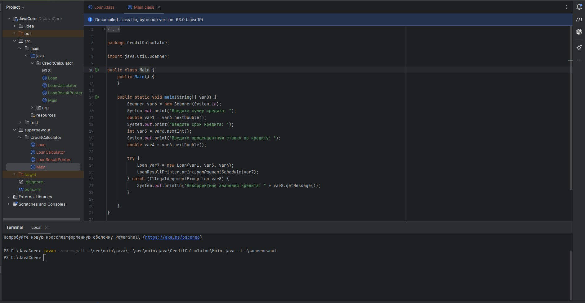
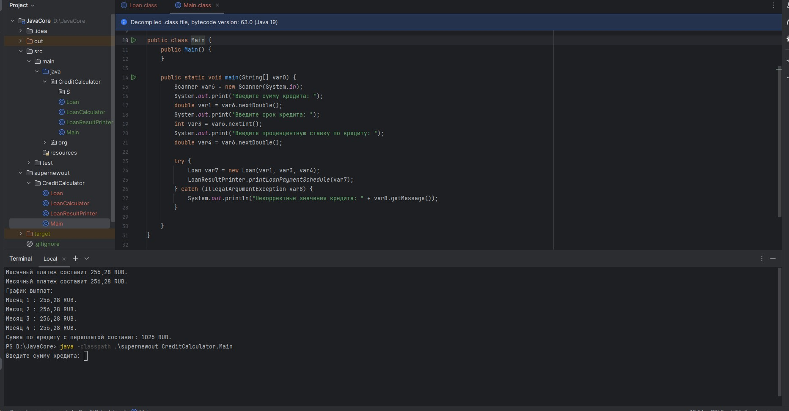

# JavaCore

Lesson 1: Compiling and Interpreting Code

        Создать приложение с вложенностью пакетов не менее 3х, где будет класс для входа и несколько классов с логикой. Пример: приложение для внесения заметок во внешний файл с обязательной фиксацией времени
        пример:
        Введите заметку: Hello, world!
        Дозапись в файл: 16.07.2023 -> Hello, world
        Скомпилируйте и запустите посредством CLI

Lesson 2: Data and Functions

        Написать метод, возвращающий количество чётных элементов массива. countEvens([2, 1, 2, 3, 4]) → 3 countEvens([2, 2, 0]) → 3 countEvens([1, 3, 5]) → 0
        Написать функцию, возвращающую разницу между самым большим и самым ма- леньким элементами переданного не пустого массива.
        Написать функцию, возвращающую истину, если в переданном массиве есть два соседних элемента, с нулевым значением.

Lesson 3. Classes and objects

        Написать прототип компаратора - метод внутри класса сотрудника, сравнивающий две даты, представленные в виде трёх чисел гггг-мм-дд, без использования условного оператора.

        Опишите класс руководителя, наследник от сотрудника. Перенесите статический метод повышения зарплаты в класс руководителя, модифицируйте метод таким образом, чтобы он мог поднять заработную плату всем, кроме руководителей. 
        В основной программе создайте руководителя и поместите его в общий массив сотрудников. 
        Повысьте зарплату всем сотрудникам и проследите, чтобы зарплата руководителя не повысилась.

Lesson 4: Handling Exceptions

        1. Задача: Проверка логина и пароля
        1 - Создать статический метод который принимает на вход три параметра: login, password и confirmPassword.
        2 - Длина login должна быть меньше 20 символов. Если login не соответствует этим требованиям, необходимо выбросить WrongLoginException.
        3 -Длина password должна быть меньше 20 символов. Также password и confirmPassword должны быть равны. Если password не соответствует этим требованиям, необходимо выбросить WrongPasswordException.
        4 - WrongPasswordException и WrongLoginException - пользовательские классы исключения с двумя конструкторами – один по умолчанию, второй принимает сообщение исключения и передает его в конструктор класса Exception.
        5 - В основном классе программы необходимо по-разному обработать исключения.
        6 - Метод возвращает true, если значения верны или false в другом случае.

        2. Задача: Эмуляция интернет-магазина
        1 - написать классы покупатель, товар и заказ;
        2 - создать массив покупателей, массив товаров и массив заказов;
        3 - создать статический метод “совершить покупку” со строковыми параметрами, соответствующими полям объекта заказа. Метод должен вернуть объект заказа
        4 - Если в метод передан несуществующий покупатель, товар или отрицательное количество, метод должен выбросить соответствующее исключение;
        5 - Вызвать метод совершения покупки несколько раз таким образом, чтобы заполнить массив покупок возвращаемыми значениями. Обработать исключения.
        6 - Вывести в консоль итоговое количество совершённых покупок после выполнения приложения.  

Lesson 5. Subtleties of work

        Имеется список студентов. Каждый студент имеет имя, список оценок и специальность.
        Найдите первых 5 студентов специальности "Информатика" с средним баллом выше 4.5, отсортированных по убыванию среднего балла.
        В решении не использовать циклы! Только StreamAPI
        class Student {
            private String name;
            private List<Double> grades;
            private String specialty;

                public double getAverageGrade() {...}
        }

